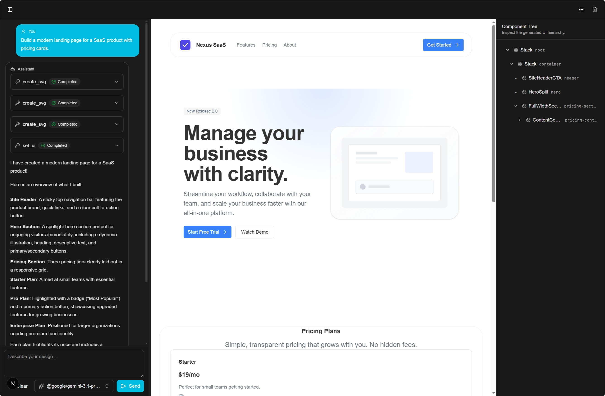
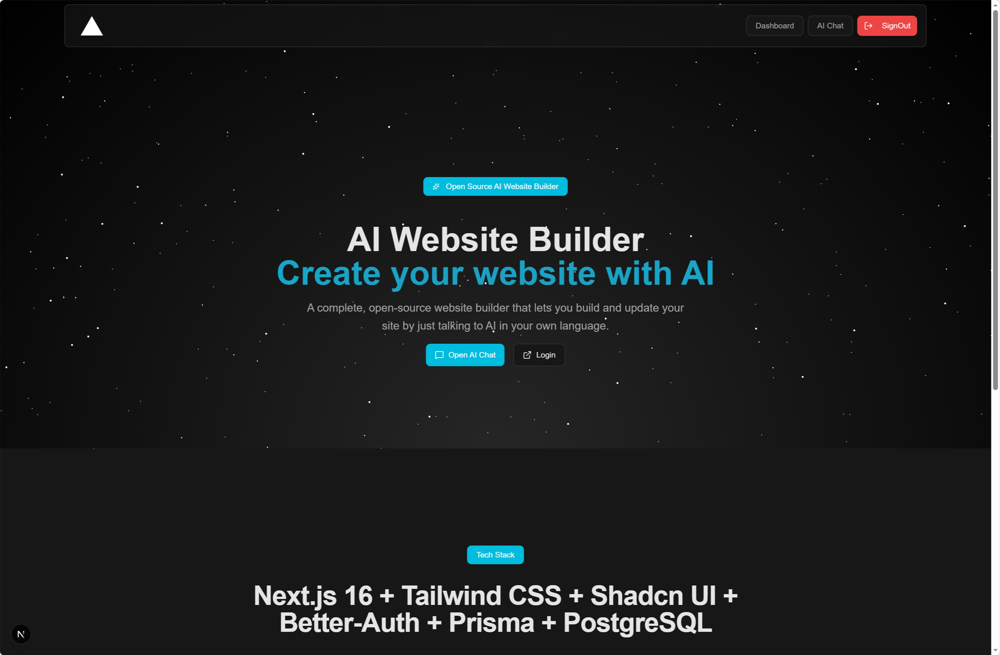

# AI Website Builder

A Proof-Of-Concept open-source website builder. The app combines a chat-first interface, AI-powered UI generation, live preview tooling, authentication, and PostgreSQL-backed persistence so users can build websites by talking to an assistant.

## Overview

This project is built with Next.js 16 and the App Router. It includes:

- Json-driven UI generation using cutom tools exposed to the agent, with a live preview of the generated UI
- Better Auth for email/password and GitHub authentication
- A chat workspace powered by the Vercel AI SDK and OpenAI-compatible models
- JSON-driven UI generation with live preview controls
- Prisma ORM with PostgreSQL for auth and chat persistence
- Tailwind CSS and shadcn/ui for the application interface
- Playwright and Vitest for automated testing
  
- 
- 

## Core Features

- Chat-based website building workflow at `/chat`
- Live AI-generated UI preview with editable UI tree state
- Reusable UI manipulation tools exposed to the chat agent
- User authentication flows for sign-in and sign-up
- Dashboard area for authenticated users
- Model selection support driven by the configured OpenAI-compatible endpoint
- Persisted chat and auth data in PostgreSQL

## Tech Stack

- Framework: Next.js 16 App Router
- Runtime/UI: React 19
- Package manager: Bun
- Auth: Better Auth
- Database: PostgreSQL + Prisma ORM
- AI: Vercel AI SDK + `@ai-sdk/openai`
- Styling: Tailwind CSS v4 + shadcn/ui + Radix UI
- Testing: Vitest + Playwright

## How It Works

### App experience

- `/` presents the marketing homepage
- `/sign-in` and `/sign-up` handle authentication
- `/chat` loads the AI website builder workspace
- `/dashboard` provides an authenticated dashboard shell

### AI workflow

The chat route in `app/api/chat/route.ts` creates a tool-enabled agent from `lib/agents/chat-agent.ts`. That agent can use UI tools from `lib/tools/ui-tools.ts` to:

- set a complete UI spec
- inspect the current generated UI
- edit, replace, or delete specific elements
- clear the preview
- register sanitized SVG assets for reuse

The frontend chat workspace in `components/chat/chat-workspace.tsx` sends chat messages, tracks model selection, and renders the generated UI preview alongside the conversation.

### Data model

The Prisma schema in `prisma/schema.prisma` includes tables for:

- Better Auth users, sessions, accounts, and verifications
- chat messages stored by thread

## Project Structure

```text
.
|- app/
|  |- (auth)/           # sign-in and sign-up routes
|  |- (root)/           # home page and chat page
|  |- (admin)/          # dashboard area
|  |- api/auth/         # Better Auth handler
|  `- api/chat/         # AI chat API route
|- components/
|  |- chat/             # chat workspace, sidebar, preview, controls
|  `- ui/               # shared shadcn/ui building blocks
|- context/             # generated UI, SVG, and component tree state
|- hooks/               # chat model loading, resizable layout, UI helpers
|- lib/
|  |- agents/           # AI agent setup
|  |- json-ui/          # UI catalog, registry, types, fixtures
|  |- tools/            # tool definitions available to the agent
|  |- auth.ts           # Better Auth server config
|  |- openai.ts         # OpenAI-compatible client and model listing
|  `- prisma.ts         # Prisma client setup
|- prisma/              # Prisma schema and migrations
`- tests/e2e/           # Playwright end-to-end tests
```

## Requirements

Before running the project locally, make sure you have:

- Bun installed
- PostgreSQL available locally or remotely
- An OpenAI-compatible API key and base URL
- GitHub OAuth credentials if you want social login enabled

## Getting Started

### 1. Install dependencies

```bash
bun install
```

`postinstall` runs `prisma generate`, so the Prisma client is generated automatically after install.

### 2. Create your environment file

Copy `.example.env` to `.env` and fill in the values:

```bash
cp .example.env .env
```

If you are on Windows without `cp`, create `.env` manually from `.example.env`.

### 3. Configure environment variables

| Variable               | Required         | Description                                       |
| ---------------------- | ---------------- | ------------------------------------------------- |
| `HOSTNAME`             | No               | Host used by Playwright and local/dev proxy setup |
| `BETTER_AUTH_SECRET`   | Yes              | Secret used by Better Auth                        |
| `BETTER_AUTH_URL`      | Yes              | Base URL for auth callbacks and session handling  |
| `DATABASE_URL`         | Yes              | PostgreSQL connection string                      |
| `GITHUB_CLIENT_ID`     | For GitHub login | GitHub OAuth app client ID                        |
| `GITHUB_CLIENT_SECRET` | For GitHub login | GitHub OAuth app client secret                    |
| `OPENAI_BASE_URL`      | Yes              | Base URL for the model provider API               |
| `OPENAI_API_KEY`       | Yes              | API key for the configured model provider         |
| `DEFAULT_MODEL`        | Yes              | Default model ID shown in the chat UI             |

Example values are documented in `.example.env`.

### 4. Run database migrations

For local development:

```bash
bun run db:migrate-dev
```

For deployed environments:

```bash
bun run db:migrate
```

### 5. Start the development server

```bash
bun run dev
```

The app runs at `http://localhost:3000` by default.

## Available Scripts

| Command                  | Description                                 |
| ------------------------ | ------------------------------------------- |
| `bun run dev`            | Start the Next.js dev server with Turbopack |
| `bun run build`          | Create a production build                   |
| `bun run start`          | Run the production server                   |
| `bun run lint`           | Run linting                                 |
| `bun run test`           | Run Vitest once                             |
| `bun run test:e2e`       | Run Playwright end-to-end tests             |
| `bun run test:e2e:debug` | Run Playwright in debug mode                |
| `bun run format`         | Format the repository with Prettier         |
| `bun run db:clean`       | Reset the database and re-run migrations    |
| `bun run db:generate`    | Regenerate the Prisma client                |
| `bun run db:migrate-dev` | Create/apply development migrations         |
| `bun run db:migrate`     | Apply production migrations                 |

## Testing

### Unit tests

```bash
bun run test
```

### End-to-end tests

```bash
bun run test:e2e
```

Current Playwright coverage lives under `tests/e2e/` and includes flows for:

- auth + chat integration
- model selector behavior
- complex UI generation
- generated UI rendering
- component tree interactions

## Development Notes

- The project uses `app/(generated)` as the Prisma client output directory.
- `lib/openai.ts` filters unsupported model categories such as embedding, image, video, and audio models before showing options in the chat UI.
- `lib/tools/toolkit.ts` is the shared registry for agent tools; add new tools there when expanding agent capabilities.
- Tool schemas should use `zod/v4` when defining new tool inputs.
- Project guidance recommends running `tscx .` after TypeScript changes to catch type errors.

## Authentication

Server-side auth is configured in `lib/auth.ts` with:

- email/password auth enabled
- GitHub as the configured social provider
- Prisma as the auth data adapter
- basic rate limiting

The Better Auth Next.js route handler lives in `app/api/auth/[...all]/route.ts`.

## Extending the Website Builder

If you want to grow the builder experience, the main extension points are:

- `lib/agents/chat-agent.ts` for agent behavior and system prompt logic
- `lib/tools/ui-tools.ts` for new tool capabilities
- `lib/json-ui/` for supported UI catalog/registry behavior
- `components/chat/` for workspace UX and preview behavior
- `app/api/chat/route.ts` for request validation and agent wiring

## Troubleshooting

- If model loading fails, verify `OPENAI_BASE_URL`, `OPENAI_API_KEY`, and `DEFAULT_MODEL`.
- If auth fails, verify `BETTER_AUTH_SECRET`, `BETTER_AUTH_URL`, and GitHub OAuth credentials.
- If Prisma client errors appear, run `bun run db:generate`.
- If database operations fail, confirm `DATABASE_URL` points to a reachable PostgreSQL instance.
- If Playwright points to the wrong host, check `HOSTNAME` and `playwright.config.ts`.

## License

MIT License. See [LICENSE](LICENSE) for details.

## Author

Mateus Junior - [GitHub](https://github.com/falleng0d)
